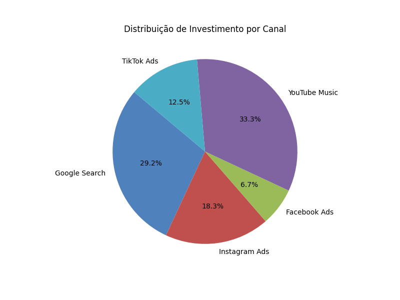
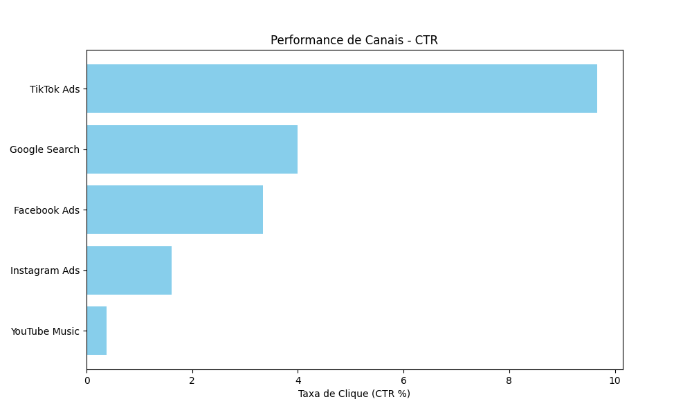

# 📊 WPP Media Analytics Tool

Sistema de análise de performance de mídia desenvolvido em **Python** com integração **SQL**, focado na automação de KPIs para agências de publicidade.

## 🚀 Funcionalidades
- **Banco de Dados SQL**: Armazenamento persistente de campanhas utilizando SQLite3.
- **Análise de Dados**: Processamento de métricas (CTR, CPC) através da biblioteca **Pandas**.
- **Data Visualization**: Geração automática de gráficos de pizza (investimento) e barras (performance) com **Matplotlib**.
- **Interface Interativa**: Menu via linha de comando (CLI) para navegação facilitada.
- **Exportação**: Geração de relatórios em formato `.csv` para integração com Excel/BI.

## 🛠️ Tecnologias Utilizadas
- Python 3.14+
- Pandas
- Matplotlib
- SQLite3

## 📈 Visualizações do Projeto
Aqui estão os gráficos gerados automaticamente pelo sistema:

### Distribuição de Investimento (Budget)


### Performance de Canais (CTR)


## 💻 Como Executar
1. Instale as dependências:
   ```bash
   pip install pandas matplotlib
